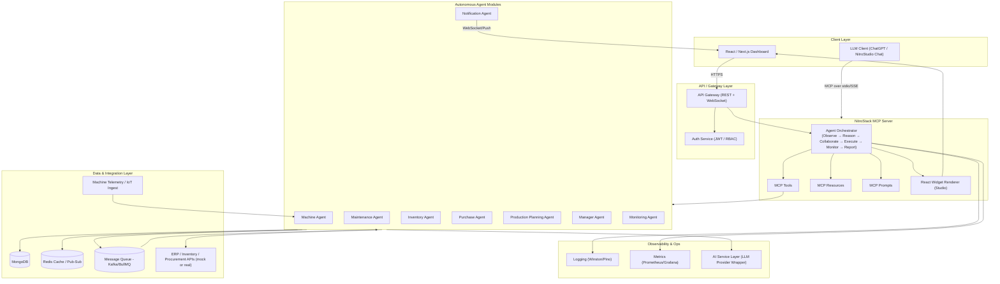
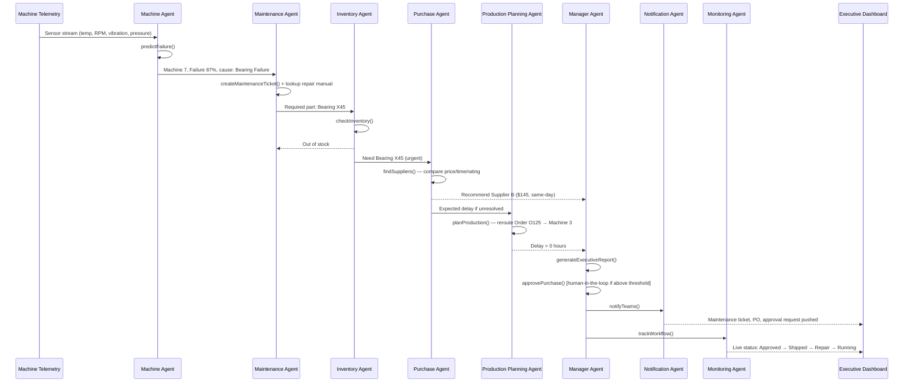

# FactoryBrain AI — System Architecture

**Multi-Agent Autonomous Manufacturing Decision System using MCP**

---

## 1. Architecture Overview

FactoryBrain AI is a **multi-agent system** orchestrated over the **Model Context Protocol (MCP)**. A NitroStack MCP Server exposes a set of **tools**, **resources**, and **prompts**; specialized agents call these tools to observe factory state, reason about failures, negotiate a recovery plan, execute actions, and report results to a manager dashboard.



---

## 2. Agent Pipeline (Sequence Flow)

The core value of the system is the **agent-to-agent handoff**, coordinated by the orchestrator rather than a single monolithic LLM call.



---

## 3. MCP Layer

### 3.1 MCP Tools (agent capabilities, callable by the orchestrator/LLM)

| Tool | Owning Agent | Description |
|---|---|---|
| `predictFailure()` | Machine Agent | Runs failure-probability inference on telemetry |
| `checkInventory()` | Inventory Agent | Looks up spare-part stock/warehouse status |
| `findSuppliers()` | Purchase Agent | Ranks suppliers by price, delivery time, rating |
| `planProduction()` | Production Planning Agent | Re-sequences/reallocates orders across machines |
| `createMaintenanceTicket()` | Maintenance Agent | Opens a ticket with required part + technician team |
| `generateExecutiveReport()` | Manager Agent | Aggregates all agent outputs into a summary |
| `approvePurchase()` | Manager Agent | Human-in-the-loop or auto-approval under policy threshold |
| `notifyTeams()` | Notification Agent | Sends alerts to maintenance/procurement/managers |
| `trackWorkflow()` | Monitoring Agent | Tracks execution status end-to-end |

### 3.2 MCP Resources (contextual read access for agents/LLM)

```
machine://M7
inventory://bearingX45
supplier://suppliers
orders://today
maintenance://history
production://schedule
employees://technicians
```

### 3.3 MCP Prompts (reusable reasoning templates)

- Failure Analysis Prompt
- Maintenance Planning Prompt
- Purchase Recommendation Prompt
- Production Optimization Prompt
- Manager Summary Prompt

### 3.4 React Widgets (rendered inside NitroStudio / dashboard)

- Machine Health Dashboard
- Inventory Card
- Supplier Comparison
- Production Timeline
- Manager Approval Panel
- Factory KPI Dashboard

NitroStack's decorator pattern cleanly separates each of these into **feature modules** (tools + resources + prompts + widgets per domain), which maps directly to the folder structure below.

---

## 4. Component Breakdown

| Layer | Responsibility | Suggested Tech |
|---|---|---|
| **Presentation** | Dashboard, machine view, inventory, supplier panel, production board, manager panel | React, Next.js, Tailwind CSS |
| **Gateway** | AuthN/AuthZ, rate limiting, request routing, WebSocket push for live updates | Node.js/Express or Next.js API routes, JWT |
| **MCP Server** | Exposes tools/resources/prompts; hosts the agent orchestrator | NitroStack MCP SDK, TypeScript |
| **Agent Modules** | One responsibility each (machine, maintenance, inventory, purchase, production, manager, notification, monitoring) | TypeScript modules/classes, decorator-based |
| **AI Service** | Wraps LLM calls (reasoning, ranking, summarization), model-agnostic | GPT-5.5 or other LLM via NitroStudio |
| **Data Store** | Persist machines, telemetry, logs, inventory, suppliers, orders, approvals | MongoDB |
| **Cache / Pub-Sub** | Fast reads for live dashboard, decoupling agent events | Redis |
| **Event Queue** | Async, reliable agent-to-agent handoff (esp. under load / retries) | Kafka, RabbitMQ, or BullMQ (Redis-based) |
| **External Integrations** | ERP, procurement, supplier APIs (mocked for hackathon) | REST/GraphQL adapters |
| **Observability** | Structured logs, metrics, tracing per agent step | Pino/Winston, Prometheus + Grafana, OpenTelemetry |
| **Deployment** | Hosting, CI/CD, secrets | NitroCloud |

---

## 5. Data Model (MongoDB Collections)

```
machines            -> id, name, status, healthScore, lastMaintenance
sensor_data          -> machineId, timestamp, temp, pressure, rpm, vibration
maintenance_logs     -> machineId, issue, action, technician, timestamp
inventory            -> partId, name, quantity, warehouse, reorderThreshold
suppliers             -> supplierId, name, price, deliveryTime, rating
employees            -> id, name, role, team, availability
production_orders    -> orderId, machineId, status, priority, dueDate
purchase_requests    -> id, partId, supplierId, status, cost, approvedBy
alerts                -> id, machineId, severity, message, timestamp
approvals             -> id, requestType, requestedBy, status, threshold
notifications        -> id, channel, recipient, message, status
```

Recommended additions:
- `audit_logs` — every autonomous agent decision + reasoning trace, for explainability and compliance.
- `agent_events` — the event-queue log of Observe/Reason/Collaborate/Execute/Monitor/Report transitions, useful for replay/debugging during the hackathon demo.

---

## 6. Folder Structure

```
factorybrain/
  src/
    app.module.ts
    index.ts
    modules/
      machine/
      maintenance/
      inventory/
      purchase/
      production/
      manager/
      monitoring/
      notification/
    widgets/
      dashboard/
      supplier-card/
      machine-card/
      production-chart/
    services/
      database.service.ts
      ai.service.ts
      queue.service.ts      # (added) pub/sub + retry handling between agents
      auth.service.ts       # (added) JWT/RBAC for gateway & approval actions
    resources/
    prompts/
  tests/                    # (added) unit + integration tests per module
  infra/                    # (added) IaC / deployment configs for NitroCloud
```

---

## 7. Suggested Additions Beyond the Original Proposal

These aren't required for a 24-hour MVP but strengthen the architecture and are worth mentioning to judges as "next steps" or adding if time permits:

1. **Event queue between agents** (BullMQ/Redis is enough for a hackathon) — decouples agents so a slow supplier lookup doesn't block the pipeline, and gives you retry/idempotency for free.
2. **Human-in-the-loop approval threshold** — auto-approve purchases below a $ threshold, require Manager Agent sign-off above it. Judges like seeing autonomy paired with guardrails.
3. **Audit/explainability log** — store each agent's reasoning output (`agent_events`), so the Manager Panel can show *why* a decision was made, not just the outcome.
4. **WebSocket live updates** — push `trackWorkflow()` status changes to the dashboard in real time instead of polling.
5. **Caching layer (Redis)** — cache supplier/inventory lookups since these are read-heavy and low-churn during a demo.
6. **Simulated telemetry generator** — a small script that streams synthetic sensor data on an interval, since real IoT hardware won't be available at a hackathon.
7. **Basic RBAC** — Manager role vs. Technician role vs. Viewer role, enforced at the gateway.
8. **Observability dashboard** — even a simple console/log stream of agent handoffs makes the "multi-agent" story visible and demoable, which is likely to be a judging focus given MCP Architecture is called out as "where the judges will pay attention."

---

## 8. Tech Stack Summary

| Category | Choice |
|---|---|
| Frontend | React, Next.js, Tailwind CSS |
| Backend | NitroStack MCP SDK, TypeScript, Node.js |
| Database | MongoDB |
| Cache / Queue (added) | Redis, BullMQ |
| AI | GPT-5.5 or another supported LLM via NitroStudio |
| Deployment | NitroCloud |
| Development | NitroStudio |

---

## 9. Hackathon MVP Build Plan (24 Hours)

| Phase | Duration | Deliverable |
|---|---|---|
| **Phase 1** | 3–4 hrs | NitroStack project setup, MongoDB schema, mock datasets, synthetic telemetry generator |
| **Phase 2** | 6–8 hrs | MCP tools: machine health, inventory lookup, supplier search, production planning, executive report generation |
| **Phase 3** | 4–5 hrs | React widgets: dashboard, supplier comparison, production timeline, approval panel |
| **Phase 4** | 3–4 hrs | AI orchestration wiring, end-to-end test in NitroStudio, deploy to NitroCloud |
| **Buffer** | 1–2 hrs | Demo script, seed a realistic failure scenario (Machine 7 / Bearing X45), polish UI |
